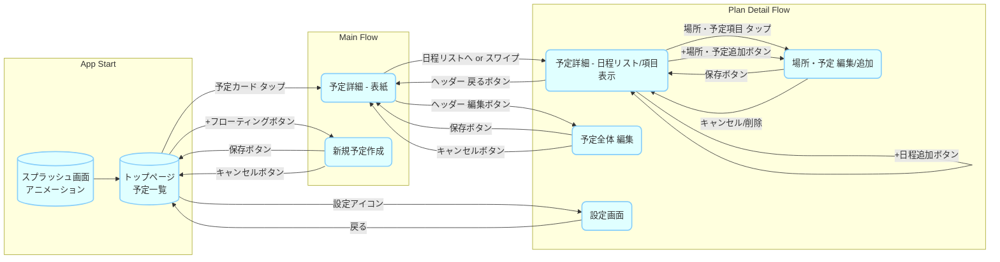
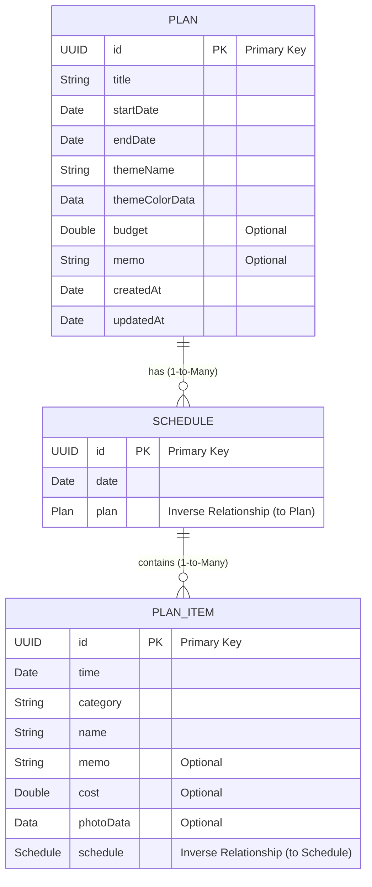

//
//  README.md
//  WakuwakuTabiShiori
//
//  Created by 二渡和輝 on 2025/04/19.
//

# (仮称) わくわく旅しおりアプリ ✈️✨

## 1. 概要

このプロジェクトは、友人グループ（特に10～20代女性）が旅行などの予定を楽しく共同で計画・共有できるiOSアプリケーションです。単なる情報共有ツールではなく、「旅行のしおり」をわくわくしながら作る体験を提供し、計画段階から気分が高まるようなアプリを目指します。

* **ターゲットユーザー:** 10～20代女性、友人グループ
* **プラットフォーム:** iOS
* **主要技術:** SwiftUI, SwiftData, CloudKit

## 2. コンセプト・デザイン

### 2.1. コアコンセプト

**「旅行のしおり」を作るような、わくわくする計画体験**

### 2.2. デザインコンセプト

**ポップで元気な感じ！**
明るく、楽しく、使っていて気分が高揚するようなデザインを目指します。

### 2.3. デザイン要素

* **カラーパレット:**
  * メイン: 明るいビタミンカラー（オレンジ、イエロー、コーラルピンク、スカイブルー等）
  * アクセント: 補色、ラメ、ネオンカラー、美しいグラデーション
  * ベース: 白や明るいグレーで視認性とバランスを確保
  * テーマ機能: 選択したテーマに基づき配色が変化
* **タイポグラフィ:**
  * 見出し: 太めで丸みのあるゴシック体や手書き風フォント
  * 本文: 読みやすく親しみやすいフォント
  * 全体: 遊び心のあるフォントをアクセントに使用
* **形・レイアウト:**
  * 要素: 角丸で柔らかい印象
  * イラスト: 手書き風、デフォルメされた可愛いキャラクターやモチーフ（星、ハート、吹き出し等）
  * レイアウト: 動きや楽しさを感じさせる配置（少し斜め、重ねるなど）
* **アイコン:**
  * 基本: シンプルなフラットデザインに少し立体感や太いアウトライン
  * カテゴリー別: ポップで可愛いイラスト調
* **アニメーション・マイクロインタラクション:**
  * ボタンタップ時の弾む反応（ポンッ！）
  * スムーズで軽快な画面遷移（ページめくり風など）
  * 達成感を演出するポップなエフェクト（キラキラ✨）
  * ローディング中の楽しいアニメーション
  * 心地よい効果音

## 3. 主要機能

* **予定管理:**
  * **新規予定作成:** タイトル、期間、テーマ、メンバー、予算（任意）を入力して新しい旅行プランを作成。
  * **予定一覧表示:**
    * トップ画面で「これからの予定」「過去の予定」をタブ切り替え。
    * 予定をアルバム風カードで表示（タイトル、期間、テーマデザイン、メンバーアイコン、カウントダウン）。
  * **予定詳細表示:**
    * **表紙:** テーマデザイン、タイトル、期間、メンバー、予算概要を表示。
    * **日程リスト:** 日付ごとにタブまたはリストで表示。日程の追加・編集・削除。
    * **場所・予定情報:** 各日程に紐づく時間、場所/活動名、カテゴリー、メモ、費用、写真などをタイムライン/カード形式で表示・編集・追加・削除。
  * **予定編集・削除:** 作成済みの予定情報全般を編集、または予定自体を削除。
* **共同編集:**
  * **メンバー招待:** ユーザー検索や招待リンクで予定にメンバーを追加・削除。
  * **情報同期 (CloudKit):** メンバーによる編集内容が他のメンバーのデバイスにも反映される。
* **予算管理:**
  * **全体予算設定:** 目安となる全体の予算を任意で設定。
  * **項目別費用入力:** 各場所・予定に費用（交通費、食費等）を任意で入力。
  * **合計費用・予算比率表示:** 入力費用の合計を自動計算し、目安予算と共に表示。割合をグラフ等で可視化。
* **テーマカスタマイズ:**
  * 予定ごとにデザインテーマ（配色、背景、アイコン等）を選択・適用。複数のポップなプリセットテーマを提供。

## 4. 画面遷移



## 5. ディレクトリ構造

```
WakuwakuTabiShori/                      <-- ⭐️ プロジェクトルート
│
├── 📂 WakuwakuTabiShori/                 <-- アプリケーションターゲットフォルダ
│   │
│   ├── 📱 WakuwakuTabiShoriApp.swift     <-- アプリ起動点 (@main), SwiftData/CloudKit設定
│   │
│   ├── 🖼️ Assets.xcassets                <-- 画像, アイコン, カスタムカラー等のリソース
│   │
│   ├── 💾 Models/                        <-- データモデル定義 (SwiftData @Model クラス)
│   │   ├── Plan.swift                   <-- 予定全体のデータ定義
│   │   ├── Schedule.swift               <-- 日程データ定義
│   │   ├── PlanItem.swift               <-- 場所・予定項目のデータ定義
│   │   └── User.swift                   <-- (必要なら)ユーザー情報モデル
│   │
│   ├── ✨ Views/                         <-- 画面UI定義 (SwiftUI View 構造体)
│   │   ├── 🏠 Main/                     <-- 主要基盤画面
│   │   │   ├── TopView.swift            <-- トップページ (予定一覧)
│   │   │   └── SettingsView.swift       <-- 設定画面
│   │   │
│   │   ├── ➕ PlanCreate/             <-- 新規予定作成関連画面
│   │   │   └── PlanCreateView.swift        <-- 新規予定入力フォーム
│   │   │
│   │   ├── 📖 PlanDetail/               <-- 予定詳細関連画面
│   │   │   ├── PlanDetailContainerView.swift <-- 詳細画面全体のコンテナ
│   │   │   ├── PlanDetailCoverView.swift <-- 詳細画面の「表紙」
│   │   │   ├── PlanDetailScheduleListView.swift <-- 日程リストと項目表示
│   │   │   ├── PlanItemRowView.swift     <-- 各予定項目の行表示
│   │   │   ├── PlanItemEditView.swift    <-- 項目追加/編集フォーム
│   │   │   └── PlanEditView.swift        <-- 予定全体の編集フォーム
│   │   │
│   │   └── 🧩 Components/               <-- 再利用可能なUI部品
│   │       ├── PlanCardView.swift       <-- 予定カードUI
│   │       ├── PopButton.swift          <-- カスタムボタンUI
│   │       └── LoadingIndicator.swift   <-- ローディング表示UI
│   │
│   ├── 🧠 ViewModels/                   <-- (MVVM採用時) Viewの状態とロジック管理クラス (@Observable)
│   │   ├── TopViewModel.swift           <-- トップ画面用ViewModel
│   │   ├── PlanDetailViewModel.swift    <-- 予定詳細画面用ViewModel
│   │   └── PlanCreateViewModel.swift       <-- 新規予定作成画面用ViewModel
│   │
│   ├── 🛠️ Utils/                    <-- ヘルパー関数、拡張機能
│   │   ├── DateFormatter+Extensions.swift <-- 日付フォーマット共通処理
│   │   ├── Color+Themes.swift           <-- テーマカラー関連処理
│   │   └── CloudKitHelper.swift         <-- (CloudKit共有処理のヘルパー等)
│   │
│   └── 📄 Info.plist                    <-- アプリ構成情報 (パーミッション等)
│
├── 📂 WakuwakuTabiShoriTests/            <-- Unitテストコード
├── 📂 WakuwakuTabiShoriUITests/          <-- UIテストコード
└── 📦 Products/                         <-- (Xcode管理) ビルド生成物
```

## 6. データモデルと永続化 (SwiftData)

本アプリケーションでは、ユーザーが作成した旅行プランや関連情報をデバイス内に永続的に保存するために **SwiftData** フレームワークを利用します。SwiftDataは、Core Dataを基盤としつつ、よりモダンなSwift構文でデータモデリング、クエリ、永続化を扱えるように設計されています。

### 6.1. データモデル（エンティティ）定義

以下の主要なデータモデル（エンティティ）を定義し、それぞれの関連性を設定します。

* **`Plan`**: 旅行プラン全体の情報を保持します。
  * `id`: UUID (一意な識別子)
  * `title`: String (旅行タイトル)
  * `startDate`: Date (開始日)
  * `endDate`: Date (終了日)
  * `themeName`: String (選択されたテーマ名)
  * `themeColorData`: Data (テーマカラーをData型で保存)
  * `budget`: Double? (目安予算、オプショナル)
  * `memo`: String? (メモ、オプショナル)
  * `timeZoneIdentifier`: String (プランのタイムゾーンID。基本は"Asia/Tokyo")
  * `createdAt`: Date (作成日時)
  * `updatedAt`: Date (最終更新日時)
  * `schedules`: `[Schedule]` (このプランに属する日程リスト。一対多、カスケード削除。開始日昇順で保持)

* **`Schedule`**: 旅行プラン内の特定の日付に対応する情報を保持します。
  * `id`: UUID (一意な識別子)
  * `date`: Date (該当日付。保存はUTC、解釈は`Plan.timeZoneIdentifier`)
  * `items`: `[PlanItem]` (この日程に属する場所・予定リスト。一対多、カスケード削除。時刻昇順で保持)
  * `plan`: `Plan` (`Plan`への逆リレーションシップ、必須)

* **`PlanItem`**: 各日程内の具体的な場所や予定の詳細情報を保持します。
  * `id`: UUID (一意な識別子)
  * `time`: Date (予定時刻。保存はUTC、解釈は`Plan.timeZoneIdentifier`)
  * `category`: String (カテゴリ種別: "transport", "meal", "sightseeing"など)
  * `name`: String (場所や予定の名称)
  * `memo`: String? (詳細メモ、オプショナル)
  * `cost`: Double? (費用、オプショナル)
  * `photoData`: Data? (関連写真データ、オプショナル。サイズ上限/圧縮方針は後述)
  * `schedule`: `Schedule` (`Schedule`への逆リレーションシップ、必須)

### 6.2. エンティティ相関図 (ER図)

各エンティティ間の関連性は以下の通りです。



* `PLAN` は複数の `SCHEDULE` を持つことができます（一対多）。
* `SCHEDULE` は複数の `PLAN_ITEM` を持つことができます（一対多）。
* `SCHEDULE` は必ず1つの `PLAN` に属します。
* `PLAN_ITEM` は必ず1つの `SCHEDULE` に属します。
* `@Relationship` の `deleteRule: .cascade` により、`Plan` が削除されると関連する `Schedule` と `PlanItem` も自動的に削除されます。同様に `Schedule` が削除されると関連する `PlanItem` も削除されます。
* 並び順: `Plan.schedules` は開始日昇順、`Schedule.items` は時刻昇順で保持・取得する。
* オプショナル削減: スケジュールとアイテムの配列は非オプショナルの空配列で初期化し、逆リレーションも必須とする。
* 期間短縮時: 対象外のSchedule/PlanItemは即削除せず、ユーザーに確認ダイアログを出し、選択されたものだけ削除する（削除時はカスケード）。
* タイムゾーン: `Plan.timeZoneIdentifier` を基準に表示し、保存はUTCで統一する。端末TZとの差分表示は必要時のみ。
* 画像サイズ: `photoData` は直格納だが、保存前にリサイズ/圧縮して上限（例: 1MB程度）を超えないようにする。必要ならサムネイルを別Dataで持ち、原本は同上限内に収める。

### 6.3. データ操作ロジック概要 (CRUD操作)

各データモデルに対する基本的な操作（作成、読み取り、更新、削除）は、主にViewModel内で `ModelContext` を介して実行されます。

* `Plan` (旅行プラン)

  * **Create**: PlanCreateViewModel の `savePlan()` 内で新しい `Plan` インスタンスを作成し、`modelContext.insert()` で保存します。関連する初期 `Schedule` も生成・保存します。
  * **Read**:
    * `TopViewModel` で `@Query` を使用し、全プランまたはフィルタリング（例: 開始日に基づく）されたプランのリストを取得・表示します。
    * 特定の `Plan` をIDなどで検索・取得する処理（必要に応じて実装）。
  * **Update**: `PlanCreateViewModel` (編集モード時) の `savePlan()` 内で既存 `Plan` のプロパティを更新します。`updatedAt` も更新します。期間変更に伴う `Schedule` の調整ロジックも実行します。
  * **Delete**: `TopViewModel` などで `modelContext.delete()` を呼び出してプランを削除します。関連する `Schedule`, `PlanItem` はカスケード削除されます。

* `Schedule` (日程)

  * **Create**:
    * `Plan` 新規作成時に、`startDate` から `endDate` までの日付に対応する `Schedule` インスタンスを自動生成し、`Plan` に関連付けて保存します。
    * `Plan` 編集時に期間が延長された場合、追加の日付に対応する `Schedule` を生成・保存します。
  * **Read**: `PlanDetailViewModel` などで、特定の `Plan` に紐づく `Schedule` のリスト (`plan.schedules`) を取得・表示します。
  * **Update**: 主に `Plan` の期間変更に伴って自動的に追加・削除されます。特定の日付自体を変更するユースケースは少ない想定ですが、必要であれば実装します（関連 `PlanItem` の扱いも考慮）。
  * **Delete**: `Plan` 編集時に期間が短縮された場合、不要になった日付に対応する `Schedule` を削除します。`Plan` 自体が削除されればカスケード削除されます。

* `PlanItem` (場所・予定)

  * **Create**: `PlanDetailViewModel` などで、ユーザーが入力した情報（時間、場所名、費用等）から新しい `PlanItem` インスタンスを作成し、対応する `Schedule` に関連付けて `modelContext.insert()` で保存します。
  * **Read**: `PlanDetailViewModel` などで、特定の `Schedule` に紐づく `PlanItem` のリスト (`schedule.items`) を取得し、時間順などでソートして表示します。
  * **Update**: `PlanItemEditView` などでユーザーが情報を編集し、ViewModelが対応する `PlanItem` のプロパティを更新します。
  * **Delete**: `PlanDetailViewModel` などで `modelContext.delete()` を呼び出して `PlanItem` を削除します。`Schedule` が削除されればカスケード削除されます。
これらのロジックを適切に実装することで、アプリのデータが整合性を保ちながら永続化され、ユーザーはいつでもプラン情報を確認・編集できるようになります。

## 7. 技術スタック

* **言語:** Swift (最新版推奨)
* **UIフレームワーク:** SwiftUI
* **データ永続化:** SwiftData
* **クラウド同期・共有:** CloudKit (SwiftData CloudKit integration)
* **バージョン管理:** Git

## 8. 開発手順概要

1.  **プロジェクト作成:** XcodeでSwiftUI Appテンプレートを選択し、SwiftDataを有効にしてプロジェクトを作成。
2.  **モデル定義:** `Models/` にSwiftDataの`@Model`クラスを定義。
3.  **ビュー実装:** `Views/` にSwiftUIで各画面のUIを実装。デザインコンセプトに基づき、モディファイアやカスタムコンポーネントを活用。
4.  **ロジック実装:** (MVVMの場合) `ViewModels/` に`@Observable`クラスを作成し、Viewの状態とビジネスロジックを実装。SwiftDataの操作（CRUD）もここで行うことが多い。
5.  **データ永続化:** `ModelContainer` を設定し、`ModelContext` を使ってデータの保存・読み込みを行う。
6.  **CloudKit連携:** プロジェクト設定でiCloudとCloudKitを有効化。`ModelConfiguration` でCloudKit同期を設定。共有機能は別途実装。
7.  **画面遷移:** `NavigationStack` / `NavigationView`, `NavigationLink`, `.sheet`, `.fullScreenCover` などで画面遷移を実装。
8.  **テスト:** Unitテスト、UIテスト、実機テストを実施。
9.  **デバッグ・最適化:** Xcodeデバッガ、Instrumentsで問題解決とパフォーマンス改善。
10. **ビルド・配布:** Archive作成後、TestFlightでのテストを経てApp Store Connectからリリース。

## 9. 今後の拡張候補

* 思い出マップ機能 (地図連携)
* やることリスト / 持ち物チェックリスト機能
* コメント機能、メンション機能
* 詳細なメンバー権限管理
* SNS連携（予定共有、写真インポート）
* プッシュ通知（リマインダー、更新通知）

## 10. 今後の実装予定

現状アプリでは以下の機能が未実装または部分的に実装されており、順次対応予定です：

### 優先度高
* **トップ画面（予定一覧）**：
  * 予定の一覧表示機能（TopView.swift）
  * ナビゲーション設定
  * フィルタリング・ソート機能

* **予定詳細の日程リスト**：
  * PlanDetailScheduleListView.swift の実装
  * 日程別の予定項目リスト表示

* **データ永続化の強化**：
  * 全ViewModelでの適切な保存処理の実装
  * エラーハンドリングの改善

### 優先度中
* **設定画面**：
  * SettingsView.swift の実装
  * アプリ設定の保存・読み込み

* **共有・CloudKit機能**：
  * CloudKit統合の設定
  * メンバー招待機能
  * データ同期処理

* **ビジュアル強化**：
  * アニメーション・トランジション
  * カスタムコンポーネントの追加実装

### 優先度低
* **詳細な予算管理**：
  * 予算使用率のグラフ表示
  * カテゴリー別支出分析

* **サポート機能**：
  * チュートリアル
  * ヘルプ/FAQ

これらの機能は段階的に実装を予定しており、まずは基本機能の完成度を高めることに注力します。

---

このREADMEはプロジェクトの進行に合わせて適宜更新してください。


/api/trpc/agent.officialAgents?input=%7B%22organizationId%22%3A%22b7d5263b-d13e-4609-a762-512cfadd58d3%22%2C%22searchText%22%3A%22%22%2C%22skip%22%3A0%2C%22take%22%3A1%2C%22categories%22%3A%5B%5D%7D


/api/trpc/agent.customAgents?input=%7B%22organizationId%22%3A%22b7d5263b-d13e-4609-a762-512cfadd58d3%22%2C%22searchText%22%3A%22%22%2C%22skip%22%3A0%2C%22take%22%3A1%2C%22categories%22%3A%5B%5D%7D

input={"organizationId":"b7d5263b-d13e-4609-a762-512cfadd58d3","searchText":"","skip":0,"take":1,"categories":[]}

## 11. 初期仕様の決定事項（共有なし・ローカル運用前提）

* アカウント・同期: Apple ID前提のシングルユーザー利用。CloudKit共有なし、ローカル保存のみ。
* オフライン: オフライン編集可。オンライン前提の同期/コンフリクト処理は不要。
* 期間短縮時の挙動: 範囲外のSchedule/PlanItemは即削除せずユーザーに確認し、手動選択で削除。
* トップ画面ソート/フィルタ: ソートは開始日昇順。フィルタは期間とテーマをサポート（参加メンバーは不要）。
* 予算・通貨: 日本円、整数のみ入力。小数や多通貨対応は行わない。
* タイムゾーン: 基本は日本時間固定。旅行先が時差ありの場合のみプラン単位でタイムゾーン選択可。
* 画像保存: PlanItemのphotoDataはSwiftDataにData直格納（外部ファイル保存なし）。
* テーマ: プリセット約10種を用意し、背景/ボタン/カードの適用範囲を表で明示。カスタムテーマ作成を許可。
* 通知: 通知機能は当面実装しない。
